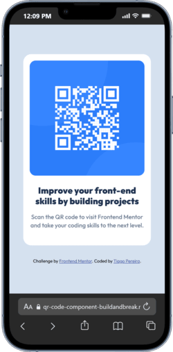
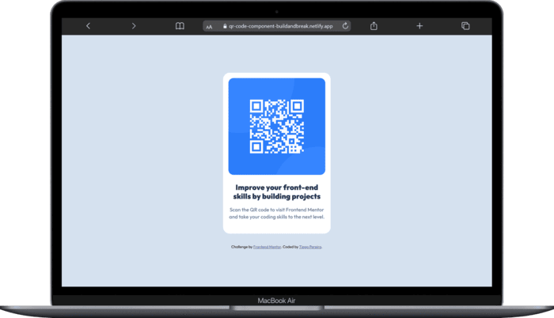

# QR Code Component

A simple QR Code component built as my first [Frontend Mentor](https://www.frontendmentor.io/) challenge after completing my fullstack course.  
The goal was to reinforce my understanding of **HTML** and **CSS**, focusing on layout structure, flexbox centering, and clean design.

## Table of contents

- [Overview](#overview)
  - [Screenshot](#screenshot)
  - [Links](#links)
- [My process](#my-process)
  - [Built with](#built-with)
  - [What I learned](#what-i-learned)
  - [Continued development](#continued-development)
  - [Useful resources](#useful-resources)
- [Author](#author)
- [Acknowledgments](#acknowledgments)

## Overview

### Screenshot

**Mobile Version**



**Laptop Version**



### Links

- **Solution URL:** [Frontend Mentor Solution](https://www.frontendmentor.io/solutions/)

- **Live Site URL:** [QR Code Component - Live](https://social-links-buildandbreak.netlify.app/)

## My process

### Built with

- Semantic **HTML5** markup
- **CSS Flexbox**
- **Mobile-first** workflow
- Basic layout and typography concepts

### What I learned

This project helped me review and apply fundamental front-end development concepts.  
Here are a few key takeaways:

- Centering elements effectively using Flexbox
- Using `max-width` and `border-radius` to create clean, card-like layouts
- I learned how to apply shadows to improve the visual depth of the component
- Keeping typography consistent with Google Fonts
- Writing clear and semantic HTML structure

#### Example of code I’m proud of:

```css
.container {
  max-width: 320px;
  background-color: white;
  display: flex;
  flex-flow: column;
  justify-content: center;
  align-items: center;
  text-align: center;
  padding: 16px 16px 40px 16px;
  border-radius: 20px;
  box-shadow: 0 10px 20px rgba(0, 0, 0, 0.15);
}
```

### Continued development

In future projects, I want to:

- Practice responsive design with media queries
- Practice CSS Grid and combine it with Flexbox
- Integrate similar components into JavaScript
- Improve file structure and CSS organization

### Useful resources

- [Frontend Mentor](https://www.frontendmentor.io/home) - Great platform for real-world front-end practice.

- [MDN Web Docs](https://developer.mozilla.org/en-US/docs/Web/CSS) - Excellent reference for CSS properties.

## Author

- Website - [Tiago Pereira](https://social-links-buildandbreak.netlify.app/)

- Frontend Mentor - [@BuildAndBreak](https://www.frontendmentor.io/profile/BuildAndBreak)

- Linkedin - [Tiago Pereira](https://www.linkedin.com/in/tiago-pereira-5a4698289/)

- Github - [@BuildAndBreak](https://github.com/BuildAndBreak)

## Acknowledgments

Big thanks to the Frontend Mentor community for providing accessible and well-structured challenges.
